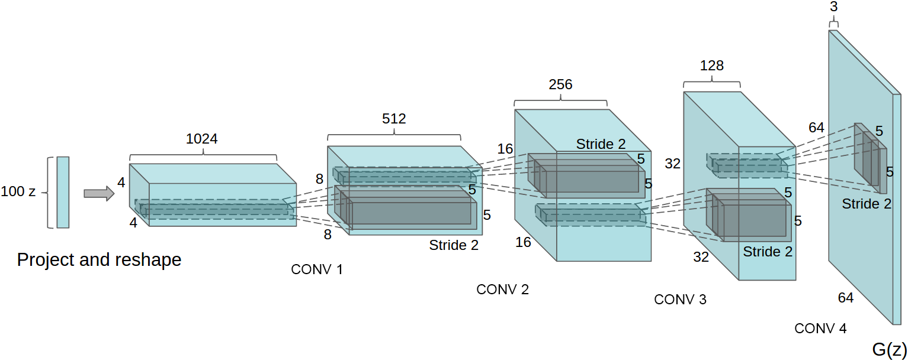
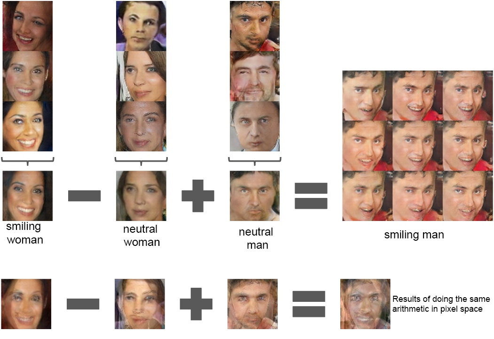

title: NPFL114, Lecture 10
class: title, langtech, cc-by-nc-sa

# Deep Generative Models

## Milan Straka

### May 6, 2019

---
# Generative Models

Generative models are given a set $\mathcal X$ of realizations of a random
variable $⁇→x$ and their goal is to estimate $P(→x)$.

~~~
Usually the goal is to be able to sample from $P(⁇→x)$, but sometimes an
explicit calculation of $P(→x)$ is also possible.

---
# Deep Generative Models

One possible approach to estimate $P(→x)$ is to assume that the random variable
$⁇→x$ depends on a _latent variable_ $⁇→z$:
$$P(→x) = P(→z) P(→x | →z).$$

~~~
We use neural networks to estimate the conditional probability with
$P_→θ(→x | →z)$.

---
section: Autoencoders
# AutoEncoders

~~~
- unsupervised feature extraction

~~~
- input compression for $z < x$

~~~
- when $→x + →ε$ is used as input, autoencoders can perform denoising

---
section: VAE
# Variational AutoEncoders

We assume $P(⁇→z)$ is fixed and independent on $⁇→x$.

We approximate $P(→x | →z)$ using $P_→θ(→x | →z)$. However, in order
to train an autoencoder, we need to know the posterior $P_→θ(→z | →x)$, which is usually
intractable.

~~~
We therefore approximate $P_→θ(→z | →x)$ by a trainable $Q_→φ(→z | →x)$.

---
# Variational AutoEncoders

Let us define _variational lower bound_ or _evidence lower bound_ (ELBO),
denoted $𝓛(→θ, →φ;⁇→x)$, as
$$𝓛(→θ, →φ;⁇→x) = \log P_→θ(→x) - D_\textrm{KL}(Q_→φ(→z | →x) || P_→θ(→z | →x)).$$

~~~
Because KL-divergence is non-negative, $𝓛(→θ, →φ;⁇→x) ≤ \log P_→θ(→x).$

~~~
By using simple properties of conditional and joint probability, we get that
$$\begin{aligned}
𝓛(→θ, →φ;⁇→x) &= 𝔼_{Q_→φ(→z | →x)} [\log P_→θ(→x) + \log P_→θ(→z | →x) - \log Q_→φ(→z | →x)] \\
              &= 𝔼_{Q_→φ(→z | →x)} [\log P_→θ(→x, →z) - \log Q_→φ(→z | →x)] \\
              &= 𝔼_{Q_→φ(→z | →x)} [\log P_→θ(→x | →z) + \log P_→θ(→z) - \log Q_→φ(→z | →x)] \\
              &= 𝔼_{Q_→φ(→z | →x)} [\log P_→θ(→x | →z)] - D_\textrm{KL}(Q_→φ(→z | →x) || P_→θ(→z)).
\end{aligned}$$

---
# Variational AutoEncoders
$$ 𝓛(→θ, →φ;⁇→x) = 𝔼_{Q_→φ(→z | →x)} [\log P_→θ(→x | →z)] - D_\textrm{KL}(Q_→φ(→z | →x) || P_→θ(→z))$$

We train a VAE by maximizing $𝓛(→θ, →φ;⁇→x)$, taking a single point estimate of the expectation and using
a prior $P_→θ(→z) = 𝓝(0, 1)$.

~~~
Note that the loss has 2 intuitive components:
- reconstruction loss: Starting with $→x$, and passing though $Q$ and then again
  through $P$ should arrive back at $→x$.
~~~
- latent loss: The distribution of $Q_→φ(→z | →x)$ should be as close to the prior $P_→θ(→z) = 𝓝(0, 1)$,
  which is independent on $→x$.

---
section: ReparametrizationTrick
# Variational AutoEncoders

In order to derivate through $→z∼Q_→φ(→z | →x)$, note that if
$$→z ∼ \mathcal{N}(→μ, →σ^2),$$

~~~
we can write $→z$ as
$$→z ∼ →μ + →σ \cdot \mathcal{N}(0, 1).$$

~~~
Such formulation then allows differentiating $→z$ with respect to
$→μ$ and $→σ$ and is called a _reparametrization trick_ (Kingma and Welling, 2013).

---
# Variational AutoEncoders

---
# Variational AutoEncoders

---
# VAE – Too High Latent Loss

---
# VAE – Too High Reconstruction Loss

---
section: GAN
# Generative Adversarial Networks

We have a _generator_, which given $→z ∼ P(⁇→z)$ generates data $→x$.

We denote the generator as $G(→z; →θ_g)$.

~~~
Then we have a _discriminator_, which given data $→x$ generates a probability
whether $→x$ comes from real data or is generated by a generator.

We denote the discrimininator as $D(→x; →θ_d)$.

~~~
The discriminator and generator play the following game:
$$\min_G \max_D 𝔼_{→x ∼ P_\textrm{data}}[\log D(→x)] + 𝔼_{→z ∼ P(⁇→z)}[\log (1 - D(G(→z)))].$$

---
# Generative Adversarial Networks

---
# Generative Adversarial Networks

---
# Generative Adversarial Networks

---
section: CGAN
# Convolutional GAN

---
section: DCGAN
# Deep Convolutional GAN

---
# Deep Convolutional GAN

---
# Deep Convolutional GAN

---
# Deep Convolutional GAN

---
# Deep Convolutional GAN

---
# Deep Convolutional GAN

---
# Deep Convolutional GAN

---
# Deep Convolutional GAN

---
# GANs are Problematic to Train

- Feature matching

~~~
- Minibatch discrimination

~~~
- Historical averaging

~~~
- Label smoothing

---
class: middle
# Minibatch Discrimination

---
section: WGAN
# Wasserstein GAN

Instead of minimizing JS divergence
$$JS(p, q) = KL(p || q) + KL(q || p),$$

~~~
Wasserstein GAN minimizes Earth-Mover distance
$$W(p, q) = \inf_{γ ∈ Π(p, q)} 𝔼_{(x, y) ∼ γ} \big[ ||x - y|| \big].$$

~~~
The joint distribution $γ ∈ Π(p, q)$ indicates how much “mass” must be transported
from $x$ to $y$, and EM is the “cost” of the optimal transport plan.

---
# Wasserstein GAN

Using a dual version of the Earth-Mover definition, we arrive at
$$W(p, q) = \sup_{f, ||f||_L ≤ 1} 𝔼_{x∼p} \big[f(x)\big] - 𝔼_{y∼q} \big[f(x)\big].$$

---
# Wasserstein GAN

---
# Wasserstein GAN

---
# Wasserstein GAN

---
section: *GAN
# Development of GANs

Generative Adversarial Networks are still in active development:

- Tero Karras, Timo Aila, Samuli Laine, Jaakko Lehtinen: **Progressive Growing of GANs for Improved Quality, Stability, and Variation** https://arxiv.org/abs/1710.10196

- Takeru Miyato, Toshiki Kataoka, Masanori Koyama, Yuichi Yoshida: **Spectral Normalization for Generative Adversarial Networks** https://arxiv.org/abs/1802.05957

- Zhiming Zhou, Yuxuan Song, Lantao Yu, Hongwei Wang, Jiadong Liang, Weinan Zhang, Zhihua Zhang, Yong Yu: **Understanding the Effectiveness of Lipschitz-Continuity in Generative Adversarial Nets** https://arxiv.org/abs/1807.00751

- Andrew Brock, Jeff Donahue, Karen Simonyan: **Large Scale GAN Training for High Fidelity Natural Image Synthesis** https://arxiv.org/abs/1809.11096

- Tero Karras, Samuli Laine, Timo Aila: **A Style-Based Generator Architecture for Generative Adversarial Networks** https://arxiv.org/abs/1812.04948

Alternative approaches are also explored: Diederik P. Kingma, Prafulla Dhariwal: **Glow: Generative Flow with Invertible 1x1 Convolutions** https://arxiv.org/abs/1807.03039
